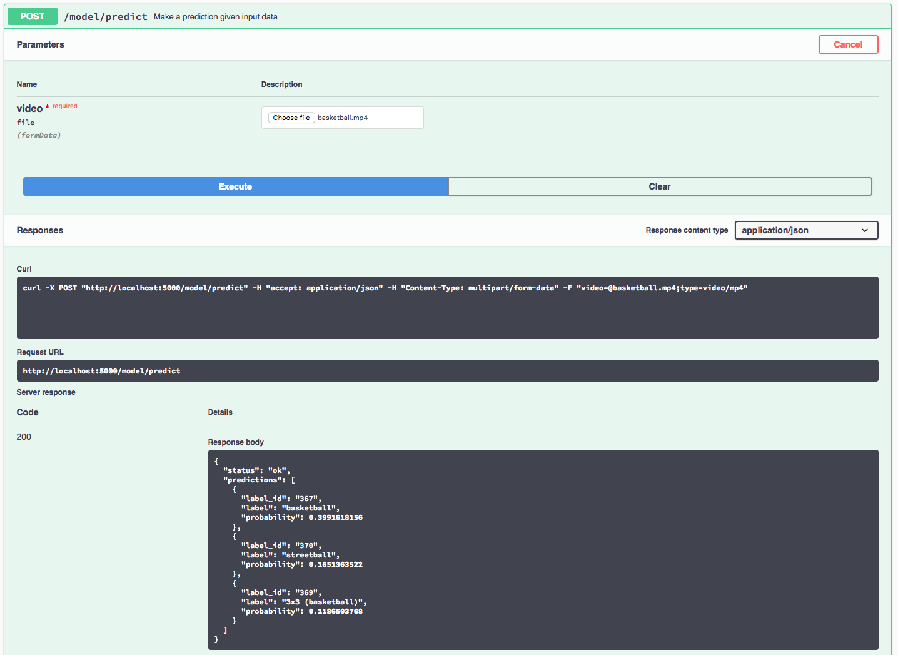

# IBM Code Model Asset Exchange: Sports Video Classifier

This repository contains code to instantiate and deploy a video classification model. The model recognizes the 487 different classes of sports activities in the [Sports-1M Dataset](https://cs.stanford.edu/people/karpathy/deepvideo/). The model consists of a deep 3-D convolutional net that was trained on the Sports-1M dataset. The input to the model is a video, and the output is a list of estimated class probabilities.

The model is based on the [C3D TensorFlow Model](https://github.com/hx173149/C3D-tensorflow). The model files are hosted on [IBM Cloud Object Storage](http://max-assets.s3-api.us-geo.objectstorage.softlayer.net/tf/c3d/max_c3d_sports1m_tf.tar.gz). The code in this repository deploys the model as a web service in a Docker container. This repository was developed as part of the [IBM Code Model Asset Exchange](http://www.example.com).

## Model Metadata
| Domain | Application | Industry  | Framework | Training Data | Input Data Format |
| ------------- | --------  | -------- | --------- | --------- | -------------- | 
| Vision | Video Classification | General | TensorFlow | [Sports-1M](https://cs.stanford.edu/people/karpathy/deepvideo/) | Video (MPEG-4)| 

## References
* _D. Tran, L. Bourdev, R. Fergus, L. Torresani, M. Paluri_, [C3D: Generic Features for Video Analysis](http://vlg.cs.dartmouth.edu/c3d/)
* _A. Karpathy, G. Toderici, S. Shetty, T. Leung, R. Sukthankar, L. Fei-Fei_, ["Large-scale Video Classification with Convolutional Neural Networks](https://cs.stanford.edu/people/karpathy/deepvideo/deepvideo_cvpr2014.pdf)
* [Sports-1M Dataset Project Page](https://cs.stanford.edu/people/karpathy/deepvideo/)
* [C3D TensorFlow Model](https://github.com/hx173149/C3D-tensorflow)

## Licenses

| Component | License | Link  |
| ------------- | --------  | -------- |
| This repository | [Apache 2.0](https://www.apache.org/licenses/LICENSE-2.0) | [LICENSE](LICENSE) |
| Model Weights | [MIT](https://opensource.org/licenses/MIT) | [C3D-TensorFlow](https://github.com/hx173149/C3D-tensorflow) |
| Model Code (3rd party) | [MIT](https://opensource.org/licenses/MIT) | [C3D-TensorFlow](https://github.com/hx173149/C3D-tensorflow) |
| Test assets | Various | [Asset README](assets/README.md) |

## Pre-requisites:

* `docker`: The [Docker](https://www.docker.com/) command-line interface. Follow the [installation instructions](https://docs.docker.com/install/) for your system.
* The minimum recommended resources for this model is 2GB Memory and 2 CPUs.

## Steps

1. [Build the Model](#1-build-the-model)
2. [Deploy the Model](#2-deploy-the-model)
3. [Use the Model](#3-use-the-model)
4. [Development](#4-development)
5. [Clean Up](#5-clean-up)

## 1. Build the Model

Clone the `MAX-C3D` repository locally. In a terminal, run the following command:

```
$ git clone https://github.com/IBM/MAX-C3D
```

Change directory into the repository base folder:

```
$ cd MAX-C3D
```

To build the docker image locally, run: 

```
$ docker build -t max-tf-c3d .
```

All required model assets will be downloaded during the build process. _Note_ that currently this docker image is CPU only (we will add support for GPU images later).

## 2. Deploy the Model

To run the docker image, which automatically starts the model serving API, run:

```
$ docker run -it -p 5000:5000 max-tf-c3d
```

## 3. Use the Model

The API server automatically generates an interactive Swagger documentation page. Go to `http://localhost:5000` to load it. From there you can explore the API and also create test requests.

Use the `model/predict` endpoint to load a test video file and get predicted labels for the video from the API.



You can also test it on the command line, for example:

```
$ curl -F "video=@assets/basketball.mp4" -XPOST http://127.0.0.1:5000/model/predict
```

```json
{
  "status": "ok",
  "predictions": [
    {
      "label_id": "367",
      "label": "basketball",
      "probability": 0.39916181564331
    },
    {
      "label_id": "370",
      "label": "streetball",
      "probability": 0.16513635218143
    },
    {
      "label_id": "369",
      "label": "3x3 (basketball)",
      "probability": 0.11865037679672
    }
  ]
}
```

## 4. Development

To run the Flask API app in debug mode, edit `config.py` to set `DEBUG = True` under the application settings. You will then need to rebuild the docker image (see [step 1](#1-build-the-model)).
